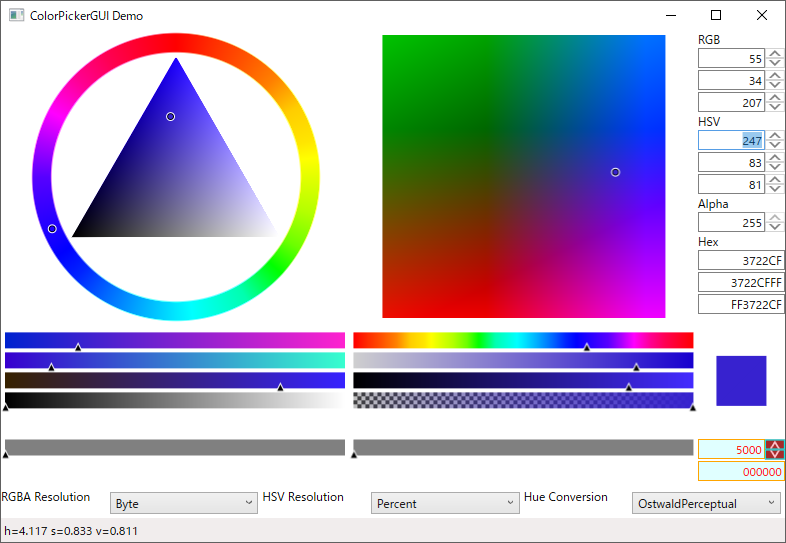

# ColorPickerWPF
 ColorPicker of WPF UserControl 

## Requirement
.NET 8.0 - windows  
WPF  

## Install
[Download DLL](https://github.com/tk-yoshimura/ColorPickerWPF/releases)  
[Download Nuget](https://www.nuget.org/packages/tyoshimura.ColorPickerWPF/)  

## Demo


## Usage

[Sample](ColorPickerGUITest)

```xml
xmlns:colorpicker="clr-namespace:ColorPicker;assembly=ColorPicker"
```

```xml
<colorpicker:HSVColorPicker
    x:Name="HSVColorPicker"
    HSVColorChanged="HSVColorPicker_HSVColorChanged"
    SelectedColor="{Binding SelectedHSV}" />
```

```csharp
private void HSVColorPicker_HSVColorChanged(object sender, HSVColorChangedEventArgs e) {
    StatusBar.Text = $"{e.Color} user - {e.UserOperation}";
}
```

## Licence
[MIT](LICENSE)

## Author

[T.Yoshimura](https://github.com/tk-yoshimura)
